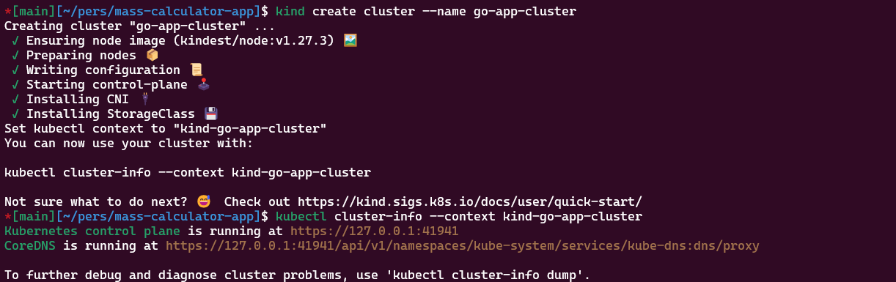
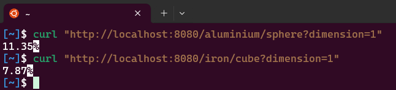
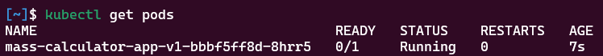

# Mass Calculator App- Example Golang Application

This repository contains a Golang application that calculates the mass of an aluminium sphere and an iron cube based on their radius and side length respectively. The application exposes two endpoints: one for calculating the mass of a sphere and one for calculating the mass of a cube.

These were the values used for density of the materials:

- Aluminiun: 2.710
- Iron: 7.874

## Requirements

- go
- docker
- helm
- kubectl
- kind

## Step 1: Go Application

### Description

The Go application calculates the mass of a *sphere* and a *cube* based on the provided dimensions and material density. The application listens on a configurable port and exposes two endpoints:

- [localhost:8080/aluminium/sphere?dimension=x](http://localhost:8080/aluminium/sphere?dimension=<radius>)
- [localhost:8080/aluminium/sphere?dimension=y](http://localhost:8080/iron/cube?dimension=<side-length>)

#### Commands to Build the App

Ensure you have Go installed. To build the application, use the following commands:

```sh
go mod init mass_calculator_app
go mod tidy
# As this is a simple app we can skip the first to commands
go build -o mass_calculator_app main.go
```

#### Testing the application

After the build command we can execute the application with this command and giving the port we want to expose:

```sh
./mass_calculator_app 8080
```

Now we can check the endpoints for testing the application

## Step 2: Containerization with Docker

### Dockerfile

It was created a simple Dockerfile to abstract the complexity to build and package this application. For that we just need the initial main.go file and follow the next steps.
The Docker file contains the required steps to do all this work. Please take note, that the exposed port is by default 8080.

#### Commands to Build the image

```sh
docker build -t mass_calculator_app:1.0.0 .
```

#### Testing the Docker application

After the build command we can execute the Docker app with this command:

```sh
docker run -d -p 8080:8080 --name mass_calculator_app mass_calculator_app:1.0.0
```

Now we can check the endpoints (see Step 1) for testing the application

## Step 3: Helm chart for deploying the application in a kubernetes cluster

For the creation of these chart it was [generate an empty Helm chart](https://helm.sh/docs/helm/helm_create/) using Helm and then just made some simple customizations to remove the unnecessary stuff and configure the service and image.

### Commands to achieve and install a packaged chart

```sh
helm create mass_calculator_app
helm package mass_calculator_app

helm install mass_calculator_app ./mass-calculator-app-0.1.0.tgz
```

## Step 4: Testing the chart

In order to complexly test all the application, go app, Dockerfile, and helm chart, it was created a kind cluster, allowing to run a sample kubernetes cluster wih the basic configurations for these purpose:

### Commands used

```sh
# Creating the cluster
kind create cluster --name go-app-cluster

# Building the docker image with the go app
docker build -t mass_calculator_app:1.0.0 .

# Loading the image into the kind cluster
kind load docker-image mass_calculator_app:1.0.0 --name go-app-cluster

# Installing the chart (make sure the .*tar.gz file was already generated in the step 3)
helm install mass_calculator_app ./mass_calculator_app-0.1.0.tgz

# Port forward the application
kubectl port-forward svc//mass_calculator_app 8080:8080

# Checking the endpoits:
curl "http://localhost:8080/iron/cube?dimension=1"
curl "http://localhost:8080/aluminium/sphere?dimension=1"
```

These commands above must be followed in sequence, and the result should be achieved without any constraint.
Here are some evidences:






